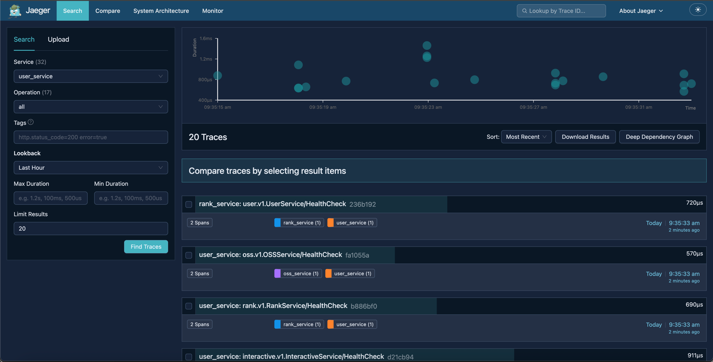
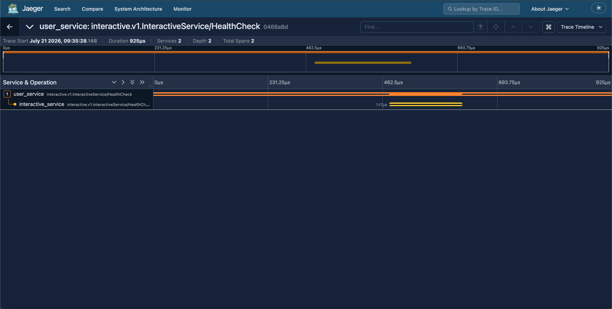

# go-postery

  

  <b>📖 Go-Postery —— 现代化微服务论坛社区 Web 项目</b>

## 简介

- 用 Go 实现一个现代化论坛
- 后端代码量：40900 + 行
- 当前分支为微服务

## 项目介绍
**技术栈：Gin + Gorm + Eino + MySQL + Redis + Qdrant + Milvus + etcd + Kafka + Rabbit + Rocket + gRPC + Prometheus + Grafana + Docker + Jaeger + BM25**
- 项目功能：短信 / 邮箱验证码注册登录、修改资料、上传头像、帖子发布修改、标签、搜索、评论关注、私信、榜单、抽奖及 AI 面试助手等功能；
- 基础设施：采用雪花算法生成分布式 ID，建立 etcd 远程配置中心读取配置并监听配置变化，利用信号机制的监听实现优雅关机；
- OSS 存储：通过阿里云 OSS 实现头像功能，服务端签名在前端直传，并对上传回调进行资源落库处理，返回预签名 URL 进行前端显示，避免公开访问 Bucket；
- 热门榜单：设计简化版的 Reddit 论坛算法，通过 Redis ZSet 实现用户和帖子热榜功能，并通过 Crontab 定时定时扫表进行榜单计算；
- 身份鉴权：通过中间件对长短双 Token 进行鉴权，其中 AccessToken 为 JWT-Token 放在请求头中，RefreshToken 为随机生成字符串放在 HTTP-Only Cookie 中，并在 Redis 中以 RefreshToken 为关键字保存用户相关信息用于刷新 AccessToken，同时也依靠 Redis 实现黑名单机制；
- 点赞评论：实现用户点赞评论等功能，通过 Kafka + Outbox 扫表进行发消息削峰，具有抢占、重试、退避设计，保证了至少一次投递，并进行消费者幂等处理，减少消息重复消费，消费后手动 ACK 减少消息丢失；设计了记录帖子 ID + 主评论 ID 的评论树结构，实现二级子评论回复功能；
- 帖子搜索：利用 sego 对搜索内容进行分词，结合自研手写的 Go-Searchery 分布式类 ElasticSearch 搜索引擎实现论坛帖子搜索功能；
- IM 即时通讯：持久化消息后利用 RabbitMQ 的 Fan-Out 模式通过 Websocket 双向投递推送到目标窗口，同时加载历史消息，设计简单实现已读和未读消息数功能；
- 运维监控：通过 Prometheus + Grafana 统计接口 QPS 和平均耗时，并进行可视化，通过 Jaeger 进行微服务间的分布式链路追踪；
- gRPC 微服务：设计并实现 etcd 服务发现和注册中心，对分布式部署的微服务进行注册、续约、健康检查、负载均衡、重试、限流、熔断、降级治理；
- 服务限流：设计滑动窗口限流算法，通过 Redis + Lua 脚本对 IP 或微服务方法调用实现限流；通过 Docker 打包镜像，使用 NGINX 代理前后端分离部署上线；
  - 上线网址：gopostery.top；
- 高并发：Redis 预热库存，验证用户抽奖资格，设计了根据实时库存计算概率的抽奖算法并通过 Redis + Lua 实现库存原子扣减，结合 RocketMQ 的延迟消息完成订单超时回收和库存回补;
  - 本地单机测试抽奖接口 QPS 2800+，平均接口耗时 70+ms;
- AI Agent：编排 7 个 Agent DAG 图，实现模拟面试系统，通过 RAG + BM25 两路检索 RRF 并行召回后重排结果，具备动态难度调节、记忆用户画像与 Skill 多轮交互能力，覆盖 JD 分析、简历匹配、智能出题、实时面试到评估报告的完整流程；
  - 构建基于 50 条标注样本的 RAG 离线评估流水线，统计 Recall@K、MRR 及 topic 分组效果，通过 A/B 对比将 TopK 从 10 调至 20，使 Recall@10 提升 7.3%，MySQL 领域召回率提升 16.7%；
## 待开发

- 设计高性能分布式 Websocket 网关
- 对每个 email、phone 设置单日验证码上限防刷
- 注册 Session 前进行 DB 唯一约束避免打爆 RabbitMQ
- 密码校验 identifier
- 找回密码功能
- 关注用户发表的文章
- 私信： 对私信前置条件进行限制（当前为任意皆可私信）、群聊
- 抽奖： 中间状态保持
- 管理员后台

## 项目演示

|                              |                      |
|:------------------------------------------------------------------:|--------------------------------------------------------------------------------|
|                    |                      |
|          |  |
|          |                      |
|                                       |                                                   |
|                              |                                                     |

## 项目难点

- **技术难点**
  - 多消息队列协同与一致性：Kafka + Outbox 扫表、RabbitMQ 实时聊天、RocketMQ 延迟订单，包含重试退避与幂等处理
  - RAG/向量检索链路：文章切分（普通/Markdown）、稳定 ChunkID、防重复写入、异步消费后入 Qdrant
  - 自研搜索引擎：BoltDB 正排 + 跳表倒排 + 位特征过滤；支持 gRPC 分布式检索 + etcd 服务发现/负载均衡
  - 实时 IM：WebSocket 心跳、MQ 扇出、会话/未读数一致性
  - 高并发抽奖：Redis 库存原子扣减 + RocketMQ 延迟消息兜底 + 超时库存回流

- **亮点与工程化**
  - 清晰分层与 ports 抽象：handler/service/repository/dao/cache/infra，便于替换组件与测试
  - 双 Token 鉴权 + 黑名单、短信/邮箱验证码校验、Snowflake 分布式 ID
  - Redis + Lua 的滑动窗口限流、验证码频控、计数更新与榜单
  - 可观测与可运维：Prometheus 指标、Slog 滚动日志、Crontab 探活、Graceful Shutdown
  - 前后端一体：Vite + React + Tailwind，覆盖发帖/评论/关注/私信/抽奖/搜索/Agent/后台等页面

- **验证与配套**
  - API 文档与统一响应/错误码体系（见 `API.md`）
  - 抽奖压测脚本与指标记录（见 `test/lottery_test.go`，README 内已有 QPS 结果）

## Star History

<a href="https://www.star-history.com/?repos=yzletter%2Fgo-postery&type=date&legend=top-left">
 <picture>
   <source media="(prefers-color-scheme: dark)" srcset="https://api.star-history.com/chart?repos=yzletter/go-postery&type=date&theme=dark&legend=top-left&sealed_token=Jaudz1QNMJl7-4RtOz2jM1AHnpAYgt3dzQ-J2i59cSZBEEX9wlPxqZRE-mJdUuZs8nMi9Q_18tnACismJvzGvMhX8Sl19w9nPUSYM-F2fQHkBhN8wJxZKs9Z4UWYYmfFL3H5gISldiRMDHtHF7THomgaIDQEfcZQKA-lEGTAlc2UbfiDtSNYpzhuwPRV" />
   <source media="(prefers-color-scheme: light)" srcset="https://api.star-history.com/chart?repos=yzletter/go-postery&type=date&legend=top-left&sealed_token=Jaudz1QNMJl7-4RtOz2jM1AHnpAYgt3dzQ-J2i59cSZBEEX9wlPxqZRE-mJdUuZs8nMi9Q_18tnACismJvzGvMhX8Sl19w9nPUSYM-F2fQHkBhN8wJxZKs9Z4UWYYmfFL3H5gISldiRMDHtHF7THomgaIDQEfcZQKA-lEGTAlc2UbfiDtSNYpzhuwPRV" />
   
 </picture>
</a>
