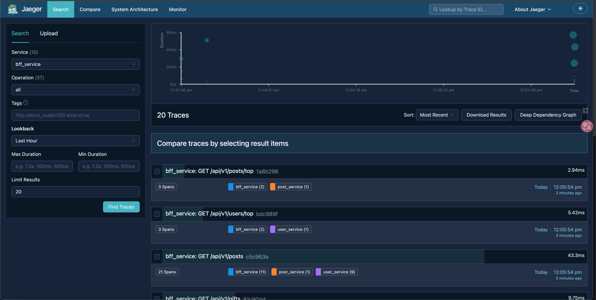
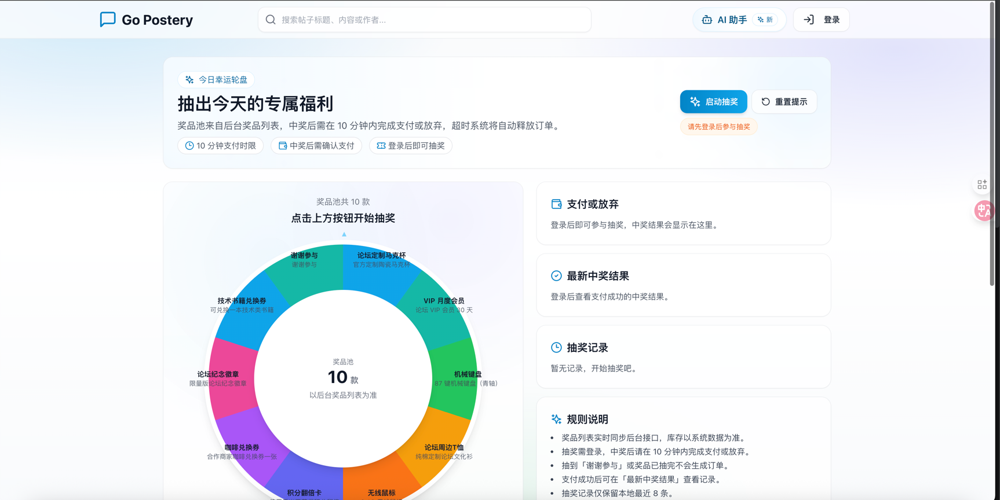

# go-postery

  

  <b>📖 Go-Postery —— 现代化论坛 Web 项目</b>

## 简介

- 用 Go 实现一个现代化论坛
- 后端纯代码量：26000 + 行
- 当前分支为微服务应用

## 项目介绍

**Gin + Eino + Gorm + Mysql + Redis + ETCD + Kafka + RabbitMQ + RocketMQ + gRPC + Prometheus + Grafana + Slog + Crontab + Jaeger**
- 功能：通过 **SnowFlake** 生成分布式ID，实现用户注册登录、帖子发布更新、评论关注私信、热门榜单、抽奖及 AI 助手等功能；
- 配置：使用 **ETCD** 远程配置中心读取配置，并监测配置变化，使用 **Slog** 日志库进行滚动存储日志；
- 限流：通过 **Redis + Lua 脚本** 实现滑动窗口限流；
- 登录：通过阿里云 **SMS** 和邮箱 **SMTP** 服务，支持通过短信 / 邮箱验证码进行登录；
- 运行：通过 **Crontab** 执行定时任务，利用信号机制实现优雅关机；
- 鉴权：结合 **JWT** 使用长短双 Token 机制；
- 榜单：采用简化的 **Reddit** 算法，通过 **Redis** 实现热榜功能；
- 点赞：通过 **Kafka** 实现点赞功能；
- 搜索：集成 **[Go-Searchery](https://github.com/yzletter/go-searchery)** 手写类 **ElasticSearch** 分布式搜索引擎，实现论坛帖子搜索功能；
- IM 即时通讯：集成 **[Go-Chatery](https://github.com/yzletter/go-chatery)** 即时通讯系统，利用 **RabbitMQ** 实现论坛用户实时私信功能；
- 高并发：集成 **[Go-Lottery](https://github.com/yzletter/go-lottery)** 高并发秒杀系统，利用 **RocketMQ** 实现论坛抽奖功能，本地单机测试 **QPS 2850**， 平均接口耗时 **79ms**；
- AI Agent：集成 **[Go-Agentery](https://github.com/yzletter/go-agentery)** AI Agent 应用，构建 **RAG** 智能体，具备多工具能力 (时间、定位、天气查询(基于高德地图 API )) 和对话记忆功能；
- 监控：通过 **Prometheus + Grafana** 统计接口 QPS 和平均耗时，并进行可视化；
- grpc 微服务：拆分微服务，对微服务进行限流、熔断、降级治理；
- 链路追踪：**OpenTelemetry + Jaeger** 分布式链路追踪；
- 性能：pprof 定位 GC 频繁问题；
- 部署上线：使用 **NGINX** 代理前后端分离部署上线，网址：[gopostery.top](http://gopostery.top)；

## 待开发

- **用户头像**
- mysql 表的抢占设计
- agent 流式传输
- agent 历史消息拉取
- 抽象出 Kafka Consumer
- 添加 RAG metadata
  1. **biz**：文本类型（plain / md）
  2. **source_id**：原始文档 id（你索引的 document_id）
  3. **chunk_id**：chunk 唯一 id（建议：`source_id + ":" + chunk_index` 或 snowflake）
  4. **chunk_index**：chunk 序号
  5. **chunk_total**：该 source 一共几个 chunk
  6. **start_offset / end_offset**：chunk 在原文中的字符区间（方便回溯定位、拼接上下文）
  7. **title / headers**：如果是 markdown，记录 header 路径（`# A / ## B`）
  8. **hash**：chunk 内容 hash（去重、幂等、更新对比非常好用）
- 对每个 email、phone 设置单日验证码上限防刷
- 注册 Session 前进行 DB 唯一约束避免打爆 RabbitMQ
- Outbox 对消息抢占避免（或乐观）多实例部署重复发送消息
  - next_retry_at 指数退避
  - 批量发送 Kafka：减少网络调用，提高吞吐
  - 运行控制：支持 ctx cancel + ticker.Stop()
- 密码校验 identifier
- 找回密码功能
- **关注用户发表的文章**
- **Auth 中间件针对 Websocket 连接的优化**
- **点赞：** 当前版本通过 Kafka 进行改造
- **私信：** 对私信前置条件进行限制（当前为任意皆可私信）、群聊
- **抽奖：** 中间状态保持
- **微服务部署与上线**
- **管理员后台**
- **拉黑功能**

## 项目演示

|                      |                      |
|:----------------------------------------------------------:|--------------------------------------------------------------------------------|
|            |                      |
|  |  |
|  |                      |
|                                |                                                     |

## 项目难点

- **技术难点**
  - 多消息队列协同与一致性：Kafka + Outbox 扫表、RabbitMQ 实时聊天、RocketMQ 延迟订单，包含重试退避与幂等处理
  - RAG/向量检索链路：文章切分（普通/Markdown）、稳定 ChunkID、防重复写入、异步消费后入 Qdrant
  - 自研搜索引擎：BoltDB 正排 + 跳表倒排 + 位特征过滤；支持 gRPC 分布式检索 + etcd 服务发现/负载均衡
  - 实时 IM：WebSocket 心跳、MQ 扇出、会话/未读数一致性
  - 高并发抽奖：Redis 库存原子扣减 + RocketMQ 延迟消息兜底 + 超时库存回流

- **亮点与工程化**
  - 清晰分层与 ports 抽象：handler/service/repository/dao/cache/infra，便于替换组件与测试
  - 双 Token 鉴权 + 黑名单、短信/邮箱验证码校验、Snowflake 分布式 ID
  - Redis + Lua 的滑动窗口限流、验证码频控、计数更新与榜单
  - 可观测与可运维：Prometheus 指标、Slog 滚动日志、Crontab 探活、Graceful Shutdown
  - 前后端一体：Vite + React + Tailwind，覆盖发帖/评论/关注/私信/抽奖/搜索/Agent/后台等页面

- **验证与配套**
  - API 文档与统一响应/错误码体系（见 `API.md`）
  - 抽奖压测脚本与指标记录（见 `test/lottery_test.go`，README 内已有 QPS 结果）

## 实现功能

- **认证与账号：** 短信/邮箱验证码登录；手机号/邮箱 + 密码登录；首次登录自动注册；设置/修改/校验密码；退出登录；双 Token 机制与黑名单
- **用户与社交：** 个人主页与资料修改；关注/取关；粉丝/关注列表；推荐关注榜单
- **帖子与互动：** 发帖/删帖/编辑；热门榜单；标签体系与按标签浏览；点赞/取消点赞；评论与回复
- **私信与会话：** 一对一实时私信；会话列表；历史消息；未读数维护；WebSocket 心跳与 MQ 推送
- **搜索：** 站内文章搜索（标题/内容分词检索）
- **抽奖：** 高并发抽奖；临时订单；支付/放弃/结果查询；库存回流
- **AI Agent：** 基于站内内容的知识库问答（RAG + 向量检索）
- **监控与运维：** Prometheus 指标；Slog 轮转日志；限流；定时任务；优雅关机
